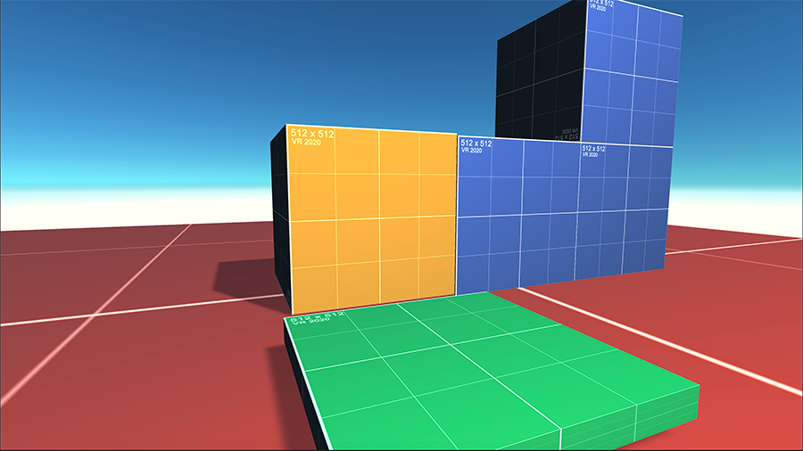

# Project Coretex

## Description

## Authors / Credits

Zaid Neurothrone (known as Professor Z) and Fredrik Persson

## Installation

Download the project with github and
open it up in Unity Hub.

## Usage

Learn more in the official documentation

## Changes

More information could be found in the CHANGELOG file.

## Contributing

Bug reports and pull requests are welcome on Github https://github.com/VR20-Nackademin/Project_Cortex

## Stay in touch

Website
Twitter
Facebook
Discord
